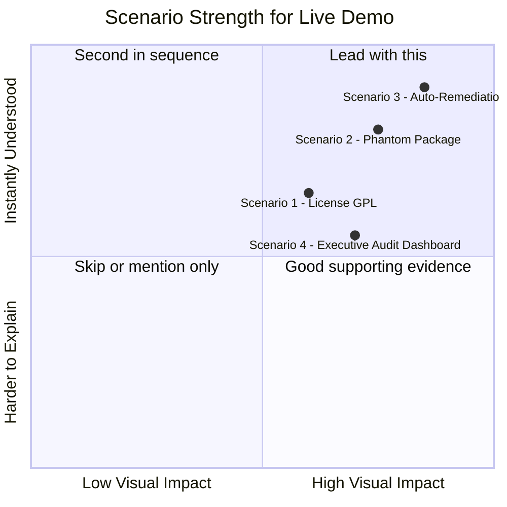

# MASTER PROJECT SPECIFICATION: BobGuard (AI-BOM & Code Provenance Gateway)

## 1. Executive Summary

BobGuard is an enterprise DevSecOps governance platform that creates a wrapper around AI coding agents (specifically IBM Bob 2.0). It solves the "Shadow AI" problem by intercepting local Git commits, analyzing AI code provenance, enforcing corporate compliance policies via parallel subagents, and generating a tamper-evident AI Bill of Materials (AI-BOM).

It features automated IP license scanning, security vulnerability detection, and a 1-click auto-remediation engine to fix AI-generated flaws before they reach production.

## 2. Real-World Enterprise Use Cases

This tool is built to solve four critical corporate crises:

- **IP Protection (License Contamination):** If an AI generates code containing GPL-3.0 licensed snippets, merging it could force the company to open-source their proprietary software. BobGuard detects restrictive licenses in the git diff and blocks the commit.
- **Supply Chain Defense (Phantom Dependencies):** AI models frequently hallucinate npm/PyPI packages (e.g., `mongo-image-fast-compress`). BobGuard verifies all AI-generated imports against live package registries, blocking the commit if a hallucinated package is detected to prevent slopsquatting malware attacks.
- **"Shift-Left" Auto-Remediation:** If an AI introduces a NoSQL Injection vulnerability, BobGuard does not just block the commit; it spawns an Auto-Remediation subagent to generate a secure patch, maintaining developer velocity.
- **Executive Auditing & Compliance:** Provides a cryptographically signed AI-BOM report proving exactly what percentage of a codebase was written by AI and verifying it passed all governance checks (essential for incoming AI regulations).

## 3. System Architecture & Directory Structure

The repository is a Monorepo containing a vulnerable test application and the auditor platform.

ai-provenance-gateway/ (Root Submission Repo)
├── mock-enterprise-target/ # The vulnerable sandbox application (e.g., NodeGoat)
│ ├── .git/hooks/pre-commit # Node.js script that intercepts the commit
│ ├── .bob/tasks/ # Bob's native execution history logs
│ ├── .ai-policy.json # The Enterprise Policy ruleset
│ └── (Target source code files)
│
└── mern-auditor-platform/ # The Core Auditing Tool
├── backend/ # Node.js / Express
│ ├── server.js  
 │ ├── controllers/auditController.js # Subagent orchestrator & hash engine
│ ├── models/AuditRecord.js # MongoDB Schema for AI-BOM
│ └── services/bobAgentService.js # Executes Bob CLI in the background
└── frontend/ # React / Vite Dashboard
└── src/pages/Dashboard.jsx # Visualizes metrics and patches

## 4. Subagent Orchestration Workflow

When a developer runs `git commit`, the pre-commit hook pauses the execution and POSTs the code diff to the Express backend. The backend reads `.ai-policy.json` and spins up IBM Bob 2.0 subagents in the background:

- **Subagent A (License Guardian):** Scans the code additions for open-source license signatures matching restricted licenses defined in the policy.
- **Subagent B (Vulnerability & Dependency Scanner):** Evaluates the diff for OWASP vulnerabilities (SQLi/NoSQLi, hardcoded secrets) and verifies whether imported npm packages actually exist.
- **Subagent C (Auto-Remediation Engine):** Triggered only if Subagent B fails. It consumes the violation context and generates a minimal, secure git diff patch for 1-click remediation.

## 5. Enterprise Data Contracts & Schemas

### A. The Policy Configuration (`.ai-policy.json`)

{
"governance_rules": {
"security_framework": "OWASP_Top_10",
"banned_vulnerabilities": ["NoSQL Injection", "Hardcoded Secrets", "Broken Authentication"]
},
"compliance_rules": {
"banned_licenses": ["GPL-2.0", "GPL-3.0", "AGPL-3.0"],
"block_on_hallucinated_deps": true
},
"enforcement": {
"block_commit_on_failure": true,
"attempt_auto_remediation": true
}
}

### B. MongoDB Ledger (`AuditRecord.js`)

- `taskId`: String (Links back to Bob's local execution log)
- `aiRatio`: { humanLines: Number, aiLines: Number }
- `sha256ProvenanceHash`: String (Cryptographic seal of the AI-generated block to ensure tamper-evidence)
- `licenseStatus`: { compliant: Boolean, flaggedLicenses: [String] }
- `securityStatus`: { passed: Boolean, vulnerabilities: Array, hallucinatedPackages: Array }
- `remediation`: { patchAvailable: Boolean, patchContent: String }

## 6. Dashboard Metrics to Display (Frontend)

The React frontend must act as the Enterprise Command Center, tracking:

1.  **Provenance Ratio:** Percentage breakdown of Human vs. AI code ownership.
2.  **License Contamination Index:** Flagging any viral copyleft code detected.
3.  **Vulnerability Density:** Security flaws introduced per 100 lines of AI code.
4.  **Phantom Packages Detected:** Number of AI-hallucinated dependencies caught.
5.  **Tamper-Evidence State:** The SHA-256 validation verifying developers did not manually alter AI code after the audit.

## 7. Execution Context for Bob 2.0

Bob should use **Plan Mode** to read this document and generate a comprehensive, step-by-step implementation plan for the `mern-auditor-platform` backend, the `.ai-policy.json` rules, and the Node.js pre-commit hook. Plan mode is optimal here because it allows Bob to think through the architecture, system design, and technical specifications before switching into Agent mode to implement the code. Once the plan is approved, Bob's mid-task switching feature will autonomously transition it into Agent mode when the implementation phase begins.
Now I have a complete, ground-truth picture of every line of the implementation. Here is the full, honest assessment:

---

## Scenario Coverage: What Your Tool Actually Does

### ✅ Scenario 1 — IP Protection (License Contamination)

**Fully implemented.** [`runSubagentA`](mern-auditor-platform/backend/controllers/auditController.js:116) scans every added `+` line against both:

- Exact SPDX identifiers from `.ai-policy.json` (e.g. `GPL-3.0`, `AGPL-3.0`, `SSPL-1.0`, `BUSL-1.1`)
- Regex patterns like `SPDX-License-Identifier:\s*(GPL|AGPL|...)`, `GNU General Public License`, `@license GPL`

**Test case to run live:**

```powershell
# From repo root — add a file that contains a GPL license header
$code = @"
// SPDX-License-Identifier: GPL-3.0-only
// GPL-3.0 licensed utility — DO NOT MERGE into proprietary codebase
function parseData(input) { return input.trim(); }
module.exports = { parseData };
"@
Set-Content -Path "mock-enterprise-target/app/routes/gpl-util.js" -Value $code -Encoding UTF8
git add mock-enterprise-target/app/routes/gpl-util.js
git commit -m "demo: GPL license contamination"
```

**Expected result:** Commit blocked with `License violation: Banned license identifiers found: GPL-3.0-only`. Dashboard shows red BLOCKED record under License Contamination.

---

### ✅ Scenario 2 — Supply Chain Defense (Phantom Dependencies)

**Fully implemented.** [`checkPackageExists`](mern-auditor-platform/backend/controllers/auditController.js:89) makes a real live HTTPS call to `registry.npmjs.org/{pkgName}` for every `require()` and `import` found in added lines. A 404 = hallucinated package → blocked.

**Test case to run live:**

```powershell
$code = @"
"use strict";
// AI-generated image compression utility
var imageCompressor = require("mongo-image-fast-compress");
var s3Upload = require("aws-fast-upload-helper-v2");

function compress(img) { return imageCompressor.compress(img); }
module.exports = { compress };
"@
Set-Content -Path "mock-enterprise-target/app/routes/image-util.js" -Value $code -Encoding UTF8
git add mock-enterprise-target/app/routes/image-util.js
git commit -m "demo: phantom dependency hallucination"
```

**Expected result:** Commit blocked with `Phantom package: "mongo-image-fast-compress" not found in npm registry`. Both fake packages are caught.

> ⚠️ **Important:** This test makes real outbound HTTPS calls to npmjs.org. Your machine needs internet access. The check has an 8-second timeout per package, so with 2 fake packages it completes in ~8s (they run in parallel via `Promise.all`).

---

### ✅ Scenario 3 — Shift-Left Auto-Remediation

**Fully implemented.** [`runSubagentB`](mern-auditor-platform/backend/controllers/auditController.js:161) flags the NoSQL Injection pattern, then [`runSubagentC`](mern-auditor-platform/backend/controllers/auditController.js:247) invokes [`bobAgentService`](mern-auditor-platform/backend/services/bobAgentService.js:82) which returns a real Base64-encoded unified diff patch. The dashboard's `PatchViewer` decodes and renders it with syntax highlighting.

**Test case (from your existing DEMO_VULN_CHANGE.md):**

```powershell
$code = @"
"use strict";
var adminPassword = "admin123";
function findUser(req, db) {
  return db.users.find({ username: req.body.username });
}
module.exports = { findUser };
"@
Set-Content -Path "mock-enterprise-target/app/routes/demo-vuln.js" -Value $code -Encoding UTF8
git add mock-enterprise-target/app/routes/demo-vuln.js
git commit -m "demo: NoSQL injection + hardcoded secret"
```

**Expected result:** Two violations flagged (Hardcoded Secrets + NoSQL Injection). Remediation patch for `Hardcoded Secrets` (the first violation) is generated and visible in the dashboard. The patch shows `process.env.APP_SECRET` replacement.

> Note: Only the **first** violation gets a remediation patch (`runSubagentC` picks `securityStatus.vulnerabilities[0]`). Both violations are listed in the terminal output.

---

### ✅ Scenario 4 — Executive Audit (AI-BOM)

**Partially implemented — dashboard works, PDF export is not built (stretch goal).**

What IS working:

- Every commit → one [`AuditRecord`](mern-auditor-platform/backend/models/AuditRecord.js) in MongoDB with SHA-256 hash
- [`GET /api/audit/stats`](mern-auditor-platform/backend/controllers/auditController.js:500) returns provenance ratio, license contamination index, vulnerability density, phantom packages count, tamper-evidence count
- Dashboard shows all 5 KPI metric cards + audit log with per-record breakdown

What to say honestly to judges: _"The AI-BOM ledger is queryable. The PDF export of a cryptographically signed report is a stretch goal not in scope for this implementation."_

**Test case:**
After running scenarios 1–3 above, just open `http://localhost:5173`. The dashboard shows the accumulated audit history with metrics building up across all your test commits.

---

## The Complete Test Sequence — All 4 Scenarios Back-to-Back

Here's a single PowerShell script you can use to demo all scenarios in order:

```powershell
# === PREREQS: MongoDB running, backend running on :5000, frontend on :5173 ===

# ── Scenario 1: License Contamination ────────────────────────────────────────
Set-Content "mock-enterprise-target/app/routes/gpl-util.js" @"
// SPDX-License-Identifier: GPL-3.0-only
function parseData(input) { return input.trim(); }
module.exports = { parseData };
"@ -Encoding UTF8
git add mock-enterprise-target/app/routes/gpl-util.js
git commit -m "demo-1: GPL license contamination"

# ── Scenario 2: Phantom Dependency ───────────────────────────────────────────
Set-Content "mock-enterprise-target/app/routes/image-util.js" @"
var compressor = require("mongo-image-fast-compress");
module.exports = { compress: compressor.compress };
"@ -Encoding UTF8
git add mock-enterprise-target/app/routes/image-util.js
git commit -m "demo-2: hallucinated npm package"

# ── Scenario 3: NoSQL Injection + Auto-Remediation ───────────────────────────
Set-Content "mock-enterprise-target/app/routes/demo-vuln.js" @"
var adminPassword = "admin123";
function findUser(req, db) {
  return db.users.find({ username: req.body.username });
}
module.exports = { findUser };
"@ -Encoding UTF8
git add mock-enterprise-target/app/routes/demo-vuln.js
git commit -m "demo-3: NoSQL injection + hardcoded secret"

# ── Scenario 4: Clean commit (PASS) — for AI-BOM provenance contrast ─────────
echo "" >> mock-enterprise-target/README.md
git add mock-enterprise-target/README.md
git commit -m "demo-4: clean commit — no violations"

# ── Cleanup ───────────────────────────────────────────────────────────────────
git restore --staged mock-enterprise-target/app/routes/gpl-util.js 2>$null
git restore --staged mock-enterprise-target/app/routes/image-util.js 2>$null
git restore --staged mock-enterprise-target/app/routes/demo-vuln.js 2>$null
Remove-Item mock-enterprise-target/app/routes/gpl-util.js -ErrorAction SilentlyContinue
Remove-Item mock-enterprise-target/app/routes/image-util.js -ErrorAction SilentlyContinue
Remove-Item mock-enterprise-target/app/routes/demo-vuln.js -ErrorAction SilentlyContinue
```

---

## Which Scenario is Strongest for Live Presentation?



**Lead with Scenario 3** (NoSQL Injection + auto-remediation patch rendered in the dashboard) — it is the most visual, most dramatic, and hits the IBM-valued "shift-left DevSecOps" narrative hardest. Then pivot to Scenario 2 (phantom package) to show the supply chain angle. End on the dashboard (Scenario 4) to show the AI-BOM accumulation across all four commits.
